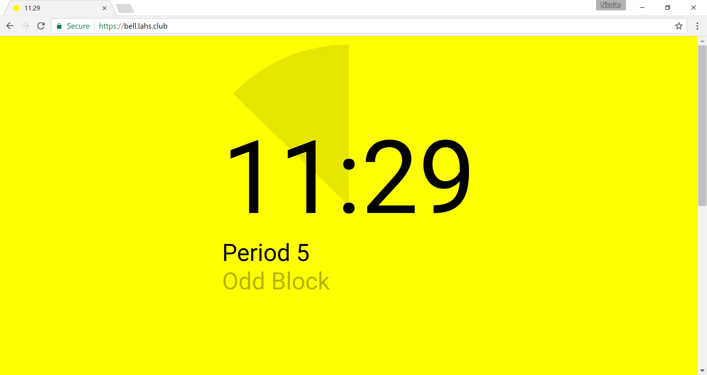
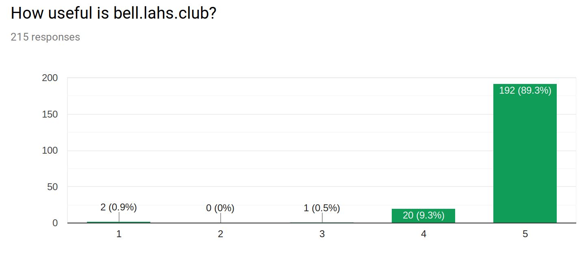
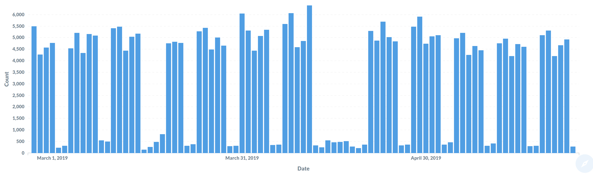

+++
title = "Creating bell.plus"
subtitle = ""

# Add a summary to display on homepage (optional).
summary = ""

date = 2019-05-25T20:00:51-07:00
draft = false

# Authors. Comma separated list, e.g. `["Bob Smith", "David Jones"]`.
authors = []

# Is this a featured post? (true/false)
featured = false

# Tags and categories
# For example, use `tags = []` for no tags, or the form `tags = ["A Tag", "Another Tag"]` for one or more tags.
tags = []
categories = []

# Projects (optional).
#   Associate this post with one or more of your projects.
#   Simply enter your project's folder or file name without extension.
#   E.g. `projects = ["deep-learning"]` references 
#   `content/project/deep-learning/index.md`.
#   Otherwise, set `projects = []`.
# projects = ["internal-project"]

# Featured image
# To use, add an image named `featured.jpg/png` to your page's folder. 
[image]
  # Caption (optional)
  caption = ""

  # Focal point (optional)
  # Options: Smart, Center, TopLeft, Top, TopRight, Left, Right, BottomLeft, Bottom, BottomRight
  focal_point = ""
+++

You'd think a countdown timer to the end of class would be an easy one-day 
project. I thought so too, but it ended up dominating my free time during 
my senior year of high school.

It began as many good projects do -- I was feeling a bit lazy. My high
school's schedule changed frequently depending on the day of the week,
and I rarely knew exactly when the bell was supposed to ring. Rather
than wait for the oh-so-slow school website to load to look up the
schedule, I decided to make a website to do the work for me. Having 
recently implemented a policy of providing Chromebooks to all students,
my high school was the perfect place for a project like this to take off,
although I didn't realize it at the time.

# What's so hard about this? 

It's just a timer, right? 

## Dealing with Special Schedules
Well, a timer needs to know when the end time is, and this was simple enough 
to hard-code. But as time went on and I started encountering special schedules, 
I decided to go a bit overboard and write a parser 
for my own format for specifying school schedules and calendars. Later on,
this would pay off when I wanted to quickly add support for additional
schools. It also features a way to enter custom schedules if your 
school isn't supported.

## Precise Timing
I suppose I was also a bit of a perfectionist, wanting it to tick over to
the next period _exactly_ when the bell rings. On devices where the system
time might be slightly incorrect, this required time synchronization with
the server. This revealed to me that even the _school's_ time was wrong and
would even vary depending on the day. I hacked together a Telegram bot I could
send messages to like `bell add 1000` to push the website 1000 ms forward
to match the school.

## Feature Creep
Inevitably, people want more features. I added support for custom themes
in a way that would make it easy to implement new ones while still
being extensible enough to support things such as a special snow effect 
during winter break.

## Acknowledgements

Jonathan Shi contributed by creating [the Chrome
extension](https://bell.plus/xt) as part of his senior project in high school.

After I went off to college, Jamsheed Mistri helped to keep the schedules
updated and we worked together on creating some stickers to promote the website.

# Analytics

What I thought would be a useful tool for myself quickly became popular at
the school, and was even requested at other schools. Feedback from from a
survey I sent out was overwhelmingly positive (1 = Not useful at all, 5 = Extremely useful):

After starting college and no longer being on the ground seeing it being used
in high school, I wanted to keep an eye on the usage. I created my own analytics
stack to avoid dependence on any external services. I put my newly learned SQL
programming skills to use when setting up [the stats page](https://bell.plus/stats)
using [Metabase](https://metabase.com).

The [public stats page](https://bell.plus/stats) includes many more charts of the
data collected, including usage by school and over the course of a day.

# Conclusions

Creating bell.plus has been one of the greatest learning experiences for me, because I was
ultimately responsible for setting it up and making sure everything continued
working well. From programming the front and backends, maintaining uptime with Docker
swarm, and performing analysis on the usage information, it has required me to 
attain at least a working familiarity with all parts of the software deployment process.
If you're interested in the specific technologies I've used, bell.plus is [open source and
available on GitHub](https://github.com/nicolaschan/bell).
Its usefulness to other students at my former high school continues to humble me and
encourage me to keep it going strong for the years to come.